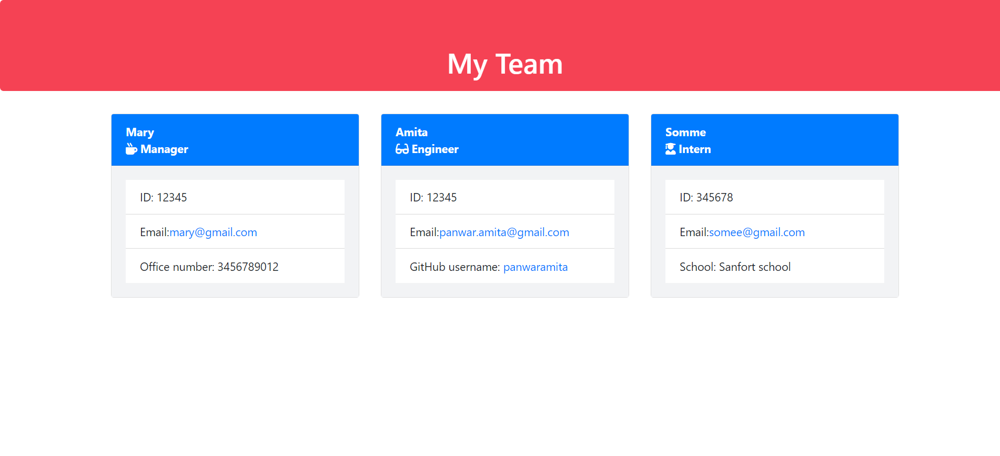
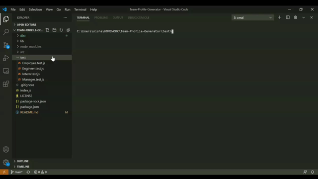

# Team-Profile-Generator

 ## Table of Contents

* [Introduction](#Introduction)
* [Installation](#Installation)
* [License](#License)
* [Screenshot](#Screenshot)
* [Link](#Link)

## Introduction

* The Team Profile Generator is a command-line-input application run in Node that requests information from the user about members of an engineering team and generates an HTML file displaying that information.
* Upon launching the app, the user is asked to enter the manger's details. Then ask the manager to choose the team member from a list (options include Engineer, Intern). If "Engineer" was selected, the app asks the user for the team member's GitHub username; if "Intern" was selected, the member's school is requested.

## Installation

* node js 
* Visual Studio Code 1.51.1
* jest

## License

## Screenshot

## Link

* Team Profile Generator Vedio:

* Team Profile Generator Test Vedio:

